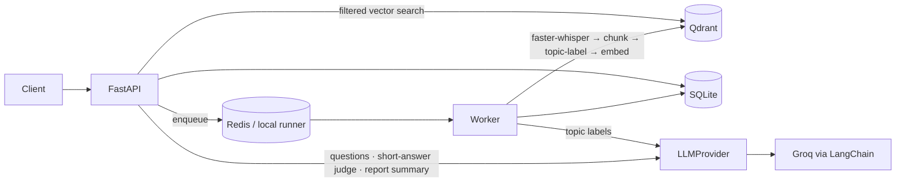

# AI-Powered LMS — Backend

[](https://github.com/avi-gajera/ai-lms-backend/actions/workflows/ci.yml)

A Python backend for an AI-powered Learning Management System. It turns an educational video into retrievable knowledge, then uses that knowledge to assess the learner:

1. **Video processing.** Upload a video (or point to a sample). Its speech is transcribed with faster-whisper, split into timestamped chunks, labelled by topic and embedded into Qdrant.
2. **Retrieval.** Semantic search inside one video returns the matching transcript chunks with timestamps.
3. **Assessment generation.** Once the learner's watch progress reaches the configured threshold (90% by default), the system generates grounded MCQ, true/false and short-answer questions that test understanding.
4. **Answer evaluation.** MCQ and true/false are graded by deterministic rules. Short answers are graded by an LLM judge against a rubric and the source transcript. Each answer gets a score, a correct/incorrect verdict, feedback and areas of improvement.
5. **Learning report.** Overall performance, a topic-by-topic breakdown, strengths, weaknesses with timestamps to rewatch, suggestions and an AI-written summary.

**Stack:**
- API: FastAPI
- Database: SQLAlchemy + Alembic on **SQLite**
- Vector DB: **Qdrant**
- Background jobs: Celery + Redis, or an in-process runner for local use
- Transcription: faster-whisper
- Embeddings: `bge-small-en-v1.5` (sentence-transformers)
- LLM: **Groq** (`gpt-oss-120b` / `gpt-oss-20b`) via LangChain integrations, behind an `LLMProvider` interface

| Document | What's in it |
|---|---|
| [docs/architecture.md](docs/architecture.md) | Architecture diagram and module layout |
| [docs/decisions.md](docs/decisions.md) | Assumptions and every engineering trade-off (D1–D26) |
| [docs/walkthrough.md](docs/walkthrough.md) | A 10-minute walkthrough script for presenting the system |
| [docs/database.md](docs/database.md) | Database schema (ERD) and vector store layout |
| [docs/openapi.json](docs/openapi.json) | Exported API specification (interactive docs at `/docs` when running) |
| [docs/sample-outputs/](docs/sample-outputs/) | Real assessments, evaluations and reports generated by the system |
| [sample_data/README.md](sample_data/README.md) | Sample videos and their licensing |

---

## Architecture



The full diagram and the data flow are in [docs/architecture.md](docs/architecture.md).

---

## Quick start (local, no Docker)

**Requirements:** Python 3.12+ (tested on 3.14), about 2 GB of disk for the ML libraries and models, and a free [Groq API key](https://console.groq.com/keys). No database server, Redis or ffmpeg needed.

```bash
# 1. Create the project environment and install dependencies
python -m venv .venv
.venv\Scripts\activate            # Windows  (macOS/Linux: source .venv/bin/activate)
pip install -r requirements-dev.txt   # runtime deps + pytest and the script dependencies

# 2. Configure
copy .env.example .env            # macOS/Linux: cp .env.example .env
# then set GROQ_API_KEY=... in .env

# 3. Download the sample lectures (3 short videos, ~43 MB)
python scripts/fetch_sample_videos.py

# 4. Start the API (the database schema is migrated automatically on startup)
uvicorn app.main:app --reload
# → http://localhost:8000/docs
```

**Run the end-to-end demo** in a second terminal. For every sample video it covers ingestion, retrieval, the progress gate, the assessment, the evaluation and the report, and it writes every response to `docs/sample-outputs/`:

```bash
python scripts/demo.py
```

**Sample outputs and demo database.** You can look at the results without running anything:
- [`docs/sample-outputs/`](docs/sample-outputs/) holds the complete API responses from the demo on all three lectures. Each video gets a readable `06_report.md`.
- [`data/demo.db`](data/demo.db) is the SQLite database from that same run: videos, transcript chunks, assessments, questions, answers and reports. Open it with `sqlite3 data/demo.db` or DB Browser for SQLite, or regenerate it with `python scripts/make_demo_db.py`.
- The vectors live in Qdrant, not in the `.db` file, so `/retrieve` on a fresh clone needs the videos to be ingested again.

**Running with no API key.** Set `LLM_PROVIDER=fake` in `.env`. A deterministic offline LLM then stands in for Groq, and the whole pipeline still runs end to end.

**First run.** faster-whisper (`base`, about 145 MB) and bge-small (about 130 MB) download on the first video processed. On a laptop CPU, transcribing a 10-minute video takes about 1–2 minutes.

## Quick start (Docker)

This runs the full production-style stack: API, Celery worker, Redis and Qdrant.

```bash
cp .env.example .env                      # set GROQ_API_KEY
python scripts/fetch_sample_videos.py     # or put your own videos in sample_data/videos/
docker compose up --build                 # first build ≈ 5-10 min (CPU torch + baked-in models)
# → http://localhost:8000/docs     (Qdrant is internal-only; see docker-compose.yml to expose its dashboard)
```

The `api`/`worker` image is the lean `runtime` build target with no test or script tooling. The tests and the demo run in the opt-in `tools` container (the `dev` target). The demo reads the answer key for the simulated learner from the database volume, and its results appear in `docs/sample-outputs/` on the host:

```bash
docker compose run --rm tools python scripts/demo.py
docker compose run --rm --no-deps tools pytest     # the offline test suite, on the dev image
docker compose logs -f worker             # watch the Celery worker process videos
docker compose cp api:/app/data/lms.db ./data/lms.db   # copy the SQLite database out of the volume
```

- The models (Whisper `base` and `bge-small`) are baked into the image at build time, so containers start without downloading anything.
- Inside Docker the SQLite file lives on a named volume, not a host bind mount. SQLite's WAL locking between the API and worker containers is only reliable on a real Linux filesystem ([D22](docs/decisions.md#d22--docker-sqlite-on-a-named-volume-shared-by-api-and-worker)).

**What was verified on the Docker stack:**
- 70/70 tests pass inside the dev image.
- The full flow works through Celery: ingestion, retrieval, generation, grading and the report.
- **Crash recovery:** SIGKILL the worker mid-transcription (`docker compose kill worker && docker compose start worker`). The unacknowledged job is re-delivered and finishes once `CELERY_VISIBILITY_TIMEOUT` expires ([D23](docs/decisions.md#d23--crash-recovery-on-redis-needs-an-explicit-visibility-timeout-found-in-testing)).

### Local mode vs. Docker mode

| | Local (default) | Docker |
|---|---|---|
| Background jobs | `TASK_BACKEND=local`: a background thread in the API process | `TASK_BACKEND=celery`: Redis plus a Celery worker container |
| Vector store | Qdrant embedded file mode (`data/qdrant/`) | Qdrant server container |
| Relational DB | SQLite `data/lms.db` | SQLite on the `lms-data` volume, shared by the API and worker containers |

The same code runs in both modes; only `.env` changes. See [D16](docs/decisions.md#d16--pluggable-job-dispatch-in-process-runner-locally-celery-in-docker).

### Production notes

Hardening from the production review ([D25](docs/decisions.md#d25--production-hardening-from-the-pre-release-review)):
- **Reproducible builds.** The image installs exact versions from `requirements.lock` (runtime) and `requirements-dev.lock` (dev extras). Edit the loose `requirements*.txt`, then regenerate the locks with `sh scripts/lock_requirements.sh` (runs in `python:3.12-slim`, needs Docker).
- **Upload limit.** Bodies over `MAX_UPLOAD_MB` (+1 MB multipart headroom) get **413** as they stream in, before anything is spooled to disk. Set a matching limit on the reverse proxy too (e.g. nginx `client_max_body_size`).
- **Slow synchronous endpoints.** `POST /assessments` (typically 20–40 s) and `POST /attempts` (5–20 s) call the LLM inside the request, and take longer while Groq rate-limits. Give the proxy and clients a read timeout of at least 120 s (e.g. nginx `proxy_read_timeout 120s`).
- **Internal services stay internal.** Only the API port is published. Redis and Qdrant have no auth configured and are reachable only on the compose network.
- **Errors.** Every error, including request validation (422), unknown routes (404) and oversized bodies (413), uses the `{"error": {...}}` envelope.
- **Request ids.** A client `X-Request-ID` is echoed only if it matches `[A-Za-z0-9._:-]{1,128}`; otherwise a fresh uuid is used.
- **Still required before public exposure:** authentication (out of scope per the brief), TLS at a reverse proxy, and Postgres instead of SQLite to run the API and workers on more than one host.

---

## API

Interactive docs are at **`/docs`** (Swagger) and **`/redoc`**. The exported spec is in [`docs/openapi.json`](docs/openapi.json).

| Method | Path | Purpose |
|---|---|---|
| `POST` | `/videos` | Register a video (multipart `file` **or** `sample_path`) and queue processing. Returns **202** with `task_id` |
| `GET` | `/videos` | List videos |
| `GET` | `/videos/{id}` | Status (`pending → processing → transcribed → indexed`, or `failed`), metadata and topics |
| `GET` | `/videos/{id}/chunks` | Transcript chunks with timestamps and topics |
| `POST` | `/videos/{id}/progress` | Report the learner's watch progress (simulates the player) |
| `POST` | `/videos/{id}/retrieve` | Semantic search within the video |
| `POST` | `/assessments` | Generate an assessment. Returns **409** until the video is indexed and progress ≥ threshold |
| `GET` | `/assessments/{id}` | Questions only; answers and rubrics are never exposed |
| `POST` | `/attempts` | Submit answers. Returns the evaluation for every question and creates the report |
| `GET` | `/attempts/{id}` | An evaluated attempt |
| `GET` | `/attempts/{id}/report` | The learning report |
| `GET` | `/tasks/{task_id}` | Background job status |
| `GET` | `/health` | Liveness, plus checks on the DB, vector store and broker |

Every error uses the same shape, and every response carries an `X-Request-ID` header that is also written in the logs:

```json
{"error": {"code": "conflict", "message": "Learner has watched 50% of this video; an assessment unlocks at 90%. ...", "request_id": "…", "details": {"progress": 0.5, "threshold": 0.9}}}
```

### Walkthrough with curl

```bash
# Register a sample video → 202 {video_id, task_id, status_url, task_url}
curl -X POST localhost:8000/videos -F sample_path=inflation_khan.mp4 -F "title=Introduction to inflation"

# Poll until status is "indexed"
curl localhost:8000/videos/<video_id>

# Search inside the video
curl -X POST localhost:8000/videos/<video_id>/retrieve -H "Content-Type: application/json" \
     -d '{"query": "Why does inflation reduce purchasing power?", "top_k": 3}'

# Report progress (≥ 0.9 unlocks the assessment), then generate one
curl -X POST localhost:8000/videos/<video_id>/progress -H "Content-Type: application/json" \
     -d '{"learner_id": "learner-1", "progress": 0.95}'
curl -X POST localhost:8000/assessments -H "Content-Type: application/json" \
     -d '{"video_id": "<video_id>", "learner_id": "learner-1", "num_questions": 8}'

# Submit answers. MCQ accepts the option text, a letter (A-D) or a number (1-4); true/false accepts true/false
curl -X POST localhost:8000/attempts -H "Content-Type: application/json" -d '{
  "assessment_id": "<assessment_id>", "learner_id": "learner-1",
  "answers": [{"question_id": "<q1>", "response": "B"},
              {"question_id": "<q2>", "response": "false"},
              {"question_id": "<q3>", "response": "Prices rise faster than incomes, so each dollar buys less."}]}'

# Learning report
curl localhost:8000/attempts/<attempt_id>/report
```

---

## How it works

### Pipeline (background job)
1. **Transcribe.** faster-whisper (`base`, int8, CPU) with VAD filtering. It decodes any audio or video container through its bundled PyAV, so no system ffmpeg is needed. The segments are stored, so a retried job skips this step.
2. **Chunk.** Windows of about 220 words with about 40 words of overlap, cut on **Whisper segment boundaries**, so every chunk keeps exact timestamps.
3. **Label topics.** The fast model labels the chunks in batches, within a topic budget that scales with the video's length. A deterministic cap enforces the budget. If labelling fails, chunks fall back to "General".
4. **Embed and index.** `bge-small-en-v1.5` (384-d) vectors are upserted into Qdrant with idempotent ids, `uuid5(video_id:chunk_index)`. Chunks are upserted into SQLite on `(video_id, chunk_index)`. Re-processing a video never duplicates anything.

### Retrieval
Dense cosine search, **always filtered to one `video_id`**. The query gets BGE's retrieval instruction prefix. The embedding model was chosen by measuring it on the sample transcripts: MRR 0.89 vs 0.73 for MiniLM ([D21](docs/decisions.md)). The reasons for leaving out hybrid/BM25 at this scale are in [D12](docs/decisions.md#d12--retrieval-strategy).

### Assessment generation
Context is chosen by **topic-balanced selection** of chunks, not by similarity search, so the quiz covers the whole video. The LLM makes **one structured-output call per question type**, each with a strict, type-specific Pydantic schema. Every prompt is grounded ("use only these chunks") and targets understanding (why, how, apply). Each question records its `topic` and `source_chunk_ids`.

After generation the questions are validated: an MCQ must have exactly 4 distinct options and one of them must match the answer, true/false must be a boolean, the source chunks must exist, and duplicates are dropped. If a type comes up short, one top-up call is made for it. See [D13](docs/decisions.md#d13--question-generation) and [D18](docs/decisions.md#d18--one-structured-output-call-per-question-type-found-in-testing).

### Evaluation
| Type | Method | Why |
|---|---|---|
| MCQ, true/false | Normalized rule-based matching (option text, letter or number; true/false/yes/no) | Deterministic, free and reproducible; can't hallucinate |
| Short answer | LLM-as-judge, batched, given the question, reference answer, rubric and source transcript. Score 0–1, correct at ≥ 0.6 | Meaning-based grading needs language understanding. Grounding plus a published rubric keep it consistent |

Every answer gets a `score`, `is_correct`, `feedback` and `improvement_areas`. Feedback for wrong answers points to the video segment to rewatch.

### Learning report
The numbers are **computed**: overall %, performance band, per-type and per-topic accuracy, strengths (≥ 80%), weaknesses (< 60%) with rewatch timestamps, and deduplicated improvement areas. Only the **prose** is generated, in one LLM call for the summary and suggestions. If that call fails, a template summary is used (`summary_source: "template"`) and the report is still produced.

### LLM integration
- `app/llm/base.py` defines the `LLMProvider` interface. `GroqProvider` wraps LangChain's `ChatGroq.with_structured_output(method="json_schema", strict=True)`. `FakeLLMProvider` is the offline stand-in.
- **Resilience:**
  - 429 errors wait for the time in Groq's `retry-after` header.
  - Schema-validation failures (Groq's HTTP 400 `json_validate_failed`) are retried.
  - Auth errors fail fast with a 503.
  - LLM failures that persist return a 502 with a message that says the request can be retried.
- Every call logs the model, token usage and the prompt version.
- Everything is explained in [D7](docs/decisions.md#d7--llm-groq-called-through-langchain-behind-our-own-llmprovider) and [D19](docs/decisions.md#d19--llm-resilience-against-real-free-tier-behaviour).

---

## Tests

```bash
pytest                  # offline test suite
ruff check .            # lint (config in pyproject.toml)
```

CI (`.github/workflows/ci.yml`) runs both on every push and pull request, on Python 3.12 with the locked dependencies.

70 tests run fully offline in about 5 seconds, using a fake LLM, hashing embeddings, in-memory Qdrant, a temporary SQLite file and a fake transcriber:

- **Unit:** chunking; MCQ and true/false grading; question-count splitting, context selection and validation; report aggregation; topic capping; Groq retry and classification logic against a stubbed client.
- **API (end to end):**
  - Ingestion, including the `failed` path, and idempotent re-processing.
  - Retrieval stays within one video.
  - Upload and path-traversal validation.
  - The progress threshold gate.
  - Assessment type mix, with correct answers hidden.
  - Perfect and mixed attempts, and attempt validation.
  - A judge failure returns 502 and persists nothing.
  - The report falls back to a template when the LLM fails.
  - HTTP hardening: 413 for oversized uploads (declared and chunked), one error envelope for validation and framework errors, request-id sanitising.

---

## Configuration

All settings are environment variables (or `.env`). The full list, with defaults, is in [`app/config.py`](app/config.py). The main ones:

| Variable | Default | Notes |
|---|---|---|
| `GROQ_API_KEY` | — | Required when `LLM_PROVIDER=groq` |
| `LLM_PROVIDER` | `groq` | `fake` runs offline and deterministically |
| `GROQ_MODEL` / `GROQ_MODEL_FAST` | `openai/gpt-oss-120b` / `openai/gpt-oss-20b` | |
| `LLM_REASONING_EFFORT` / `_FAST` | `medium` / `low` | Set empty for non-reasoning models |
| `DATABASE_URL` | `sqlite:///data/lms.db` | A Postgres URL also works |
| `TASK_BACKEND` | `local` | `celery` in Docker |
| `QDRANT_URL` / `QDRANT_PATH` | unset / `data/qdrant` | Server vs. embedded |
| `WHISPER_MODEL_SIZE` | `base` | `tiny` … `large-v3` |
| `MAX_UPLOAD_MB` | `500` | Larger bodies are rejected with 413 while streaming |
| `COMPLETION_THRESHOLD` | `0.9` | Progress needed to unlock an assessment |
| `DEFAULT_NUM_QUESTIONS` / `DEFAULT_QUESTION_MIX` | `8` / 40% MCQ, 20% T/F, 40% short | Can be overridden per request |

---

## Assumptions and scope

These are recorded in [docs/decisions.md §A](docs/decisions.md#a-assumptions).

- There is no frontend, so `POST /videos/{id}/progress` simulates the player's completion signal.
- Auth isn't specified, so `learner_id` is passed in the request body. `app/api/deps.py` is the place an auth dependency would plug in.
- The API doesn't download YouTube URLs. Samples are fetched ahead of time by a script.
- Assessment generation and grading run synchronously inside the request, typically taking 5–40 s on the Groq free tier (see [Production notes](#production-notes) for proxy timeouts). Only video processing runs in the background. The same job pattern could be applied to them if needed.

## Project layout

```
app/
  api/          HTTP layer: videos, assessments, attempts, tasks
  core/         logging (JSON + request ids), exception hierarchy and handlers, body-size middleware
  db/           SQLAlchemy models, session (SQLite WAL pragmas)
  llm/          LLMProvider interface, Groq and fake providers, output schemas, prompts
  schemas/      API request/response models
  services/     pipeline, transcription, chunking, embeddings, retrieval,
                question generation, grading, evaluation, report
  workers/      job functions, local runner / Celery dispatch, Celery app and tasks
alembic/        migrations
scripts/        fetch_sample_videos.py, demo.py, export_openapi.py, lock_requirements.sh
tests/          unit/ and api/ (offline)
.github/        CI workflow: ruff + pytest
docs/           architecture, decisions, database, openapi.json, sample-outputs/
sample_data/    sample video list and licensing (videos are fetched, not committed)
requirements.txt / requirements-dev.txt    loose, human-edited dependencies
requirements.lock / requirements-dev.lock  exact pins the Docker image installs
pyproject.toml  tool config only (ruff, pytest)
```

## How this was built

The project was built with [Claude Code](https://claude.com/claude-code) using the [AI-DLC](https://github.com/awslabs/aidlc-workflows) (AI-Driven Development Life Cycle) method, one commit per phase of the plan. These files belong to that tooling, not to the application:

| Path | What it is |
|---|---|
| `.claude/`, `aidlc/`, `.mcp.aidlc-shipped.json` | The AI-DLC framework (third-party, from AWS Labs) and its rule files |
| `CLAUDE.md` | Project instructions for Claude Code: stack, rules, commands, architecture |
| `AI-Powered_LMS.md` | The original brief and implementation plan (phases 0–9) the build followed |

All of the application is in `app/`, `alembic/`, `scripts/` and `tests/`. Every design choice is recorded in [docs/decisions.md](docs/decisions.md).
