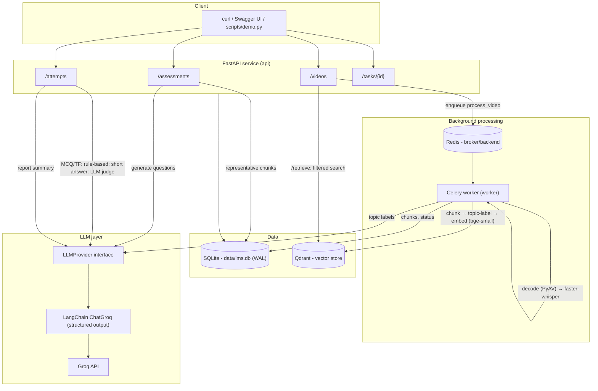

# Architecture

The same diagram as text:

1. **Ingest (async).** `POST /videos` stores the file (or, for a `url`, validates the link against the host allowlist), creates a `Video(pending)` row, and enqueues `process_video` on Redis. The Celery worker then works through these steps:
   0. For a `url`: status `downloading`; yt-dlp checks the length, then downloads only the audio track (D27).
   1. The audio is decoded and resampled to 16 kHz mono (PyAV, with bundled FFmpeg libraries).
   2. faster-whisper produces timestamped segments.
   3. The segments are grouped into chunks with overlap.
   4. Groq labels each chunk with its topic, within a length-scaled topic budget.
   5. bge-small-en-v1.5 embeds the chunks.
   6. The vectors are upserted into Qdrant with idempotent ids, and the chunks into SQLite.
   7. The video status is set to `indexed`.
2. **Retrieve.** `POST /videos/{id}/retrieve` embeds the query and runs a Qdrant search filtered by `video_id`, returning the top-k chunks with their timestamps and topics.
3. **Assess.** `POST /videos/{id}/progress` records progress. `POST /assessments` first checks the completion threshold. It then picks representative chunks for each topic, makes one grounded, structured Groq call per question type, validates the output, and saves the questions.
4. **Evaluate + report.** `POST /attempts` grades MCQ and true/false with rules, and short answers with one batched LLM-judge call. It then aggregates results by topic and type without the LLM, and makes one Groq call for the summary text. `GET /attempts/{id}/report` returns the saved report.

## Module layout

| Path | Responsibility |
|---|---|
| `app/api/` | HTTP layer: validation, status codes, dependency wiring. No business logic. |
| `app/services/` | Business logic: pipeline, transcription, chunking, embeddings, retrieval, question generation, evaluation, report. |
| `app/llm/` | `LLMProvider` interface, the Groq implementation, the fake implementation, and the prompt templates. |
| `app/db/` | SQLAlchemy models and session (SQLite WAL pragmas). |
| `app/workers/` | Celery app and task definitions (thin wrappers around the services). |
| `app/core/` | Logging (JSON, request IDs) and the exception hierarchy and handlers. |
