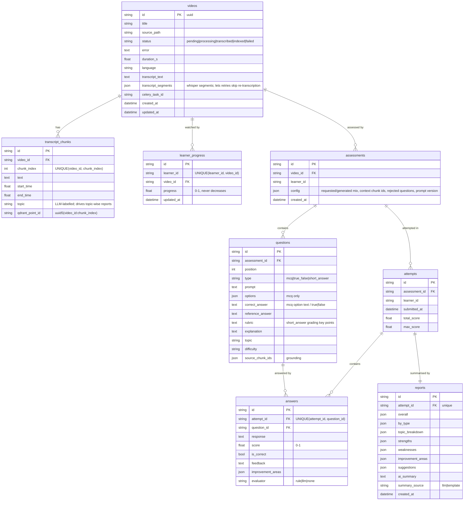

# Database schema

- **Relational data:** SQLite (`data/lms.db`, WAL mode), managed with SQLAlchemy 2 and Alembic. The migrations are in `alembic/versions/`, and `alembic upgrade head` creates the schema. The API also runs the migrations automatically at startup.
- **Vectors:** stored in Qdrant, in the collection `transcript_chunks` (see the bottom of this page).

## Design notes

- **Portable types only.** IDs are UUID strings, and structured fields use `JSON`. The schema runs unchanged on PostgreSQL: set `DATABASE_URL=postgresql+psycopg://…` and install `psycopg`.
- **Idempotency keys.**
  - `UNIQUE(video_id, chunk_index)` lets re-processing a video upsert its chunks instead of duplicating them.
  - `UNIQUE(learner_id, video_id)` gives each learner exactly one progress row per video.
  - `UNIQUE(attempt_id, question_id)` allows one answer per question per attempt.
- **Cascades.** Deleting a video deletes its chunks, progress, assessments, attempts and reports.
- **Answers are not exposed.** `questions.correct_answer`, `reference_answer` and `rubric` are stored for grading. `GET /assessments/{id}` never returns them. `POST /attempts` reveals them only after grading.

## Vector store (Qdrant)

| Field | Value |
|---|---|
| Collection | `transcript_chunks`, one for all videos |
| Vector | 384-d, cosine distance, `BAAI/bge-small-en-v1.5` (normalized; queries carry the BGE instruction prefix) |
| Point id | `uuid5(namespace, "{video_id}:{chunk_index}")`, so the same chunk always maps to the same point |
| Payload | `page_content` (chunk text), plus `metadata.{video_id, chunk_id, chunk_index, start_time, end_time, topic}` |
| Payload indexes | `metadata.video_id` (keyword) and `metadata.chunk_index` (integer), on a Qdrant server |

Every search is filtered by `metadata.video_id`.
